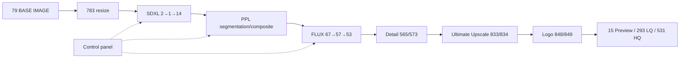

# Master architecture

> Source: `Epspoziciya_archviz_ph_sdxlflux_v001.json` only. SHA-256 `ea48f7df4d6d9727d45cd6f6d2fb9b54df7bc1cba8a436e30a1400628475be4e`.  
> Status vocabulary: **CONFIRMED** = directly present in graph data/topology; **INFERRED** = purpose inferred from naming/topology; **NOT CONFIRMED** = runtime behavior cannot be proved from workflow JSON alone.

## Production path

**CONFIRMED:** BASE IMAGE node 79 is resized by 783. SDXL uses model 2, conditioning 5/6 plus ControlNet stack 417/419/418, latent selector 535, sampler 1 and decode 14. The image passes through detail/PPL preparation, FLUX img2img nodes 67/57/53, mask-guided detail conservation 565/573, upscale 833/834, logo overlays 848/849, preview 15 and saves 730/531/293.

## Current modes

- **CONFIRMED — CURRENT MASTER MODE:** node 541 = `1`, TXT+CNET2IMG. Node 535 therefore selects empty latent node 3; node 600 selects denoise `1.0` because node 609 equals node 541, so comparison `a != b` is false.
- **CONFIRMED — CURRENT IPADAPTER MODE:** node 168 = `1` (plain SDXL model), node 630 = `1` (first IPA image if IPA is selected), node 721 = `0` (zero IPA weight).
- **CONFIRMED — CURRENT FLUX PROMPT MODE:** node 453 = `1`, GLOBAL prompt conditioning from node 811; Florence2 conditioning node 52 is unselected.
- **CONFIRMED — CURRENT PEOPLE MODE:** node 543 = `1` (FLUX people source). Downstream people selectors 459/522/552 receive this value; final selector 715 also receives it but has widget `2` overridden by linked node 543, so runtime selection is input 1. The visible widget value `2` is not authoritative while its `Input` socket is linked.
- **CONFIRMED — CURRENT DETAIL CONSERVATION MODE:** nodes 565/573 use `add`, blend values are linked from node 720 = `0.09`; node 834 is bypassed (`mode=4`).

## Groups

| NODE ID | TITLE | TYPE | CURRENT VALUE | MODE | UPSTREAM | DOWNSTREAM |
|---|---|---|---|---|---|---|
| 1 | KSampler | KSampler | [269307996847904, "randomize", 25, 2.6, "dpmpp_2m_sde", "karras", 1] | 0 | 87, 230, 231, 230, 230, 230, 418, 418, 535, 600 | 14 |
| 2 | Load SDXL Checkpoint | CheckpointLoaderSimple | ["RealVisXL_V4.0.safetensors"] | 0 | — | 6, 7, 86, 14, 168, 536 |
| 3 | # PREVIEWS (ONLY IF GENERATION=1) | EmptyLatentImage | [512, 512, 4] | 0 | 783, 783 | 535 |
| 5 | SDXL Prompt POSITIVE | CLIPTextEncode | ["masterpiece architecture photography of a black tinyhouse made entirely of straight vertical (black:1.5) woodplanks, the house has a glass facade on the right side with a glass parapet infront and a low horizontal window on the left side, a completely closed basement level, surrounded by a dense dark mystic forest of detailed old lush pine trees, dense wafts of fog surrounding the scene, moss, fern, mushrooms, vignette, low key photography"] | 0 | 87, 897 | 418 |
| 6 | SDXL Prompt NEGATIVE | CLIPTextEncode | ["(hands), text, error, cropped, (worst quality:1.2), (low quality:1.2), normal quality, (jpeg artifacts:1.3), signature, watermark, username, blurry, anime, cartoon, cgi, painting, sketch (copyright:1.2), "] | 0 | 2, 814 | 418 |
| 7 | IPAdapterAdvanced | IPAdapterAdvanced | [1, "style transfer", "concat", 0, 1, "V only"] | 0 | 9, 12, 13, 2, 721 | 168 |
| 9 | IPAdapter Prep Img ClipVis | PrepImageForClipVision | ["LANCZOS", "center", 0] | 0 | 630 | 7 |
| 12 | Load SDXL CLIP Vision | CLIPVisionLoader | ["CLIP-ViT-H-14-laion2B-s32B-b79K.safetensors"] | 0 | — | 7 |
| 13 | Load SDXL IPAdapter Model | IPAdapterModelLoader | ["ip-adapter-plus_sdxl_vit-h.safetensors"] | 0 | — | 7 |
| 14 | VAEDecode | VAEDecode | — | 0 | 2, 1 | 565, 715 |
| 15 | Preview FINAL IMAGE | PreviewImage | — | 0 | 849 | — |
| 21 | Load SDXL DEPTH-ControlNet Model | ControlNetLoader | ["diffusers_xl_depth_full.safetensors"] | 0 | — | 417 |
| 23 | Load SDXL CANNY-ControlNet Model | ControlNetLoader | ["diffusers_xl_canny_full.safetensors"] | 0 | — | 419 |
| 25 | LoadImage | LoadImage | ["V_1_d.jpg", "image"] | 0 | — | 784, 675 |
| 38 | DepthAnythingV2Preprocessor | DepthAnythingV2Preprocessor | ["depth_anything_v2_vitl.pth", 1536] | 0 | 79 | 39, 542 |
| 39 | PreviewImage | PreviewImage | [] | 0 | 38 | — |
| 41 | LoadImage | LoadImage | ["d40595bb-7497-4dd4-a433-c1d58c335220.jfif", "image"] | 0 | — | 793 |
| 42 | LoadImage | LoadImage | ["d40595bb-7497-4dd4-a433-c1d58c335220.jfif", "image"] | 0 | — | 630, 793 |
| 52 | FLUX Prompt POSITIVE (Florence2) | CLIPTextEncode | ["masterpiece architecture photography of a black tinyhouse made entirely of (black wood:1.5) planks in a dense forest of detailed old pine trees close to a beautiful lake with crystalclear water on a sunny day with warm sunlight"] | 0 | 466, 158 | 453 |
| 53 | VAEDecode | VAEDecode | — | 0 | 57, 54 | 141, 72, 730, 834, 888 |
| 54 | Load FLUX VAE | VAELoader | ["ae.safetensors"] | 0 | — | 53, 67, 496, 494, 829, 833 |
| 57 | SamplerCustomAdvanced | SamplerCustomAdvanced | — | 0 | 61, 60, 58, 59, 67 | 53 |
| 58 | KSamplerSelect | KSamplerSelect | ["euler"] | 0 | — | 57, 495, 828 |
| 59 | BasicScheduler | BasicScheduler | ["beta", 4, 0.18] | 0 | 64, 771 | 57 |
| 60 | BasicGuider | BasicGuider | — | 0 | 64, 62 | 57 |
| 61 | RandomNoise | RandomNoise | [890292281185527, "randomize"] | 0 | 231 | 57, 495, 828 |
| 62 | FluxGuidance | FluxGuidance | [2.4000000000000004] | 0 | 453 | 60 |
| 64 | ModelSamplingFlux | ModelSamplingFlux | [1.15, 0.5, 1168, 1680] | 0 | 467, 783, 783 | 59, 60, 498, 497, 819, 833 |
| 67 | VAEEncode | VAEEncode | — | 0 | 54, 573 | 57 |
| 71 | Image Comparer INPUT / SDXL | Image Comparer (rgthree) | [[{"name": "A", "selected": true, "url": "/api/view?filename=rgthree.compare._temp_yskra_00001_.png&type=temp&subfolder=&rand=0.4819337102859328"}, {"name": "B", "selected": true, "url": "/api/view?filename=rgthree.compare._temp_yskra_00002_.png&type=temp&subfolder=&rand=0.6409433261569788"}]] | 0 | 79, 779 | — |
| 72 | Image Comparer SDXL / FLUX | Image Comparer (rgthree) | [[{"name": "A", "selected": true, "url": "/api/view?filename=rgthree.compare._temp_jnuzl_00001_.png&type=temp&subfolder=&rand=0.11998567934868709"}, {"name": "B", "selected": true, "url": "/api/view?filename=rgthree.compare._temp_jnuzl_00002_.png&type=temp&subfolder=&rand=0.8975468557213796"}]] | 0 | 53, 779 | — |
| 79 | LoadImage | LoadImage | ["V_1_di.jpg", "image"] | 0 | — | 38, 165, 451, 71, 695, 715, 783, 785 |
| 86 | CLIPSetLastLayer | CLIPSetLastLayer | [-1] | 0 | 2 | 87 |
| 87 | Lora Loader Stack (rgthree) | Lora Loader Stack (rgthree) | ["None", 0.5, "None", 1, "None", 1, "None", 1] | 0 | 86, 168 | 1, 5 |
| 107 | (Down)Load SAM2Model - SINGLE | DownloadAndLoadSAM2Model | ["sam2.1_hiera_base_plus.safetensors", "single_image", "cuda", "bf16"] | 0 | — | 115, 585 |
| 112 | (Down)Load Florence2Model | DownloadAndLoadFlorence2Model | ["gokaygokay/Florence-2-Flux-Large", "fp16", false] | 0 | — | 157, 550, 580 |
| 113 | PreviewImage | PreviewImage | [] | 0 | 550 | — |
| 114 | Florence2toCoordinates | Florence2toCoordinates | ["", false] | 0 | 550 | 115 |
| 115 | Sam2Segmentation | Sam2Segmentation | [true, true] | 0 | 107, 114, 780 | 144, 524 |
| 138 | FLUX Prompt NEGATIVE | CLIPTextEncode | [""] | 0 | 466 | 494, 833 |
| 141 | Image Comparer FLUX / UPSCALE | Image Comparer (rgthree) | [[{"name": "A", "selected": true, "url": "/api/view?filename=rgthree.compare._temp_xigic_00001_.png&type=temp&subfolder=&rand=0.5372788916996013"}, {"name": "B", "selected": true, "url": "/api/view?filename=rgthree.compare._temp_xigic_00002_.png&type=temp&subfolder=&rand=0.5816535080414749"}]] | 0 | 53, 833 | — |
| 144 | GrowMask | GrowMask | [5, true] | 0 | 115 | 146 |
| 146 | MaskBlur+ | MaskBlur+ | [10, "auto"] | 0 | 144 | 420, 500 |
| 153 | UpscaleModelLoader | UpscaleModelLoader | ["4x-UltraSharp.pth"] | 0 | — | 833 |
| 154 | UPSCALE BY FACTOR | easy float | [3] | 0 | — | 832, 833, 835 |
| 157 | Florence2Run | Florence2Run | ["", "more_detailed_caption", true, false, 1024, 3, true, "", 356538594646064, "randomize"] | 0 | 112, 779 | 158 |
| 158 | ShowText\|pysssss | ShowText\|pysssss | ["The image shows an old, dilapidated stone building with arches and pillars. The building appears to be old and weathered, with cracks and chips in the stone. The walls are made of large, irregularly shaped stones, and the floor is made up of small, square tiles. In the center of the image, there is a tall palm tree with long, thin leaves. The palm tree is facing towards the right side of the image. The sky is visible in the background, and it is a pale blue color. The image is taken from a low angle, looking up at the building and the palm tree. The lighting is dim, casting a warm glow on the building. There are several small windows and doors visible on the walls, and a metal railing can be seen on the left side of this image."] | 0 | 157 | 52 |
| 165 | Image Edge Detection Filter | Image Edge Detection Filter | ["normal"] | 0 | 79 | 167, 732 |
| 167 | PreviewImage | PreviewImage | [] | 0 | 165 | — |
| 168 | 1=SDXL/ 2=SDXL+IPA | CR Model Input Switch | [1] | 0 | 7, 2 | 87 |
| 230 | SDXL Config | KSampler Config (rgthree) | [28, 1, 3.4000000000000004, "dpmpp_3m_sde_gpu", "karras"] | 0 | — | 1, 1, 1, 1 |
| 231 | GLOBAL Seed | Seed (rgthree) | [1097719867246391, null, null, null] | 0 | — | 1, 61 |
| 232 | Sam2AutoSegmentation | Sam2AutoSegmentation | [32, 64, 0.8, 0.95, 1, 0, 0, 0.7, 0.7, 0.34, 1, 0, false, true] | 0 | 234, 779 | 233 |
| 233 | PreviewImage | PreviewImage | — | 0 | 232 | — |
| 234 | (Down)Load SAM2Model - AUTO | DownloadAndLoadSAM2Model | ["sam2.1_hiera_base_plus.safetensors", "automaskgenerator", "cuda", "bf16"] | 0 | — | 232 |
| 293 | Image Save LQ | Image Save | ["ph\\[time(%Y-%m-%d)]", "ph01_archviz_sdxl2flux_LQ2", "_", 4, "false", "jpg", 72, 100, "true", "false", "false", "false", "true", "false", "false"] | 0 | 849 | — |
| 301 | LoadImage | LoadImage | ["logo.png", "image"] | 0 | — | 845, 848 |
| 309 | LoadImage | LoadImage | ["Изображение Codex 26 авг. 2026 г., 15_00_59.png", "image"] | 0 | — | 840, 849 |
| 337 | MaskFromRGBCMYBW+ | MaskFromRGBCMYBW+ | [0.3, 0.3, 0.3] | 0 | 338 | 339, 346, 347, 348, 349, 350, 352, 354 |
| 338 | LoadImage | LoadImage | ["V_1_g.jpg", "image"] | 0 | — | 337 |
| 339 | MaskToImage | MaskToImage | — | 0 | 337 | 340 |
| 340 | PreviewImage | PreviewImage | [] | 0 | 339 | — |
| 341 | PreviewImage | PreviewImage | [] | 0 | 346 | — |
| 342 | PreviewImage | PreviewImage | [] | 0 | 347 | — |
| 343 | PreviewImage | PreviewImage | [] | 0 | 350 | — |
| 344 | PreviewImage | PreviewImage | [] | 0 | 349 | — |
| 345 | PreviewImage | PreviewImage | [] | 0 | 348 | — |
| 346 | MaskToImage | MaskToImage | — | 0 | 337 | 341 |
| 347 | MaskToImage | MaskToImage | — | 0 | 337 | 342 |
| 348 | MaskToImage | MaskToImage | — | 0 | 337 | 345 |
| 349 | MaskToImage | MaskToImage | — | 0 | 337 | 344 |
| 350 | MaskToImage | MaskToImage | — | 0 | 337 | 343 |
| 351 | PreviewImage | PreviewImage | [] | 0 | 352 | — |
| 352 | MaskToImage | MaskToImage | — | 0 | 337 | 351 |
| 353 | PreviewImage | PreviewImage | [] | 0 | 354 | — |
| 354 | MaskToImage | MaskToImage | — | 0 | 337 | 353 |
| 408 | PROMPT PPL FLUX | Text Multiline | ["a few Middle Eastern townspeople wearing long beige robes and simple head coverings, naturally walking and standing in an old stone city square, realistic proportions, small and medium scale figures, candid documentary look, visually integrated into the scene, warm evening light"] | 0 | — | 823 |
| 409 | PreviewImage | PreviewImage | [] | 0 | 829 | — |
| 417 | Control Net Stacker DEPTH | Control Net Stacker | [0.39, 0, 1] | 0 | 21, 542, 723 | 419 |
| 418 | Apply ControlNet Stack | Apply ControlNet Stack | — | 0 | 6, 5, 419 | 1, 1 |
| 419 | Control Net Stacker CANNY | Control Net Stacker | [1, 0, 1] | 0 | 23, 417, 722, 732 | 418 |
| 420 | easy imageCropFromMask | easy imageCropFromMask | [1, 1, 1] | 0 | 146, 780 | 781 |
| 422 | easy imageRemBg | easy imageRemBg | ["Inspyrenet", "Save", "ph_ppl", true, "none", false] | 0 | 781 | 430, 475 |
| 429 | Paste By Mask | Paste By Mask | ["keep_ratio_fit"] | 0 | 451, 449, 779 | 672 |
| 430 | MaskToImage | MaskToImage | — | 0 | 422 | 747, 751, 449 |
| 449 | Cut By Mask | Cut By Mask | [0, 0] | 0 | 477, 430 | 429 |
| 451 | MaskToImage | MaskToImage | — | 0 | 79 | 429, 480, 749 |
| 453 | SWITCH 1=GLOBAL Prompt / 2= Florence2 | CR Conditioning Input Switch | [1] | 0 | 52, 811 | 62, 833 |
| 456 | SWITCH CNET: 1=EXTRA / 2=PREPROCESS | INTConstant | [1] | 0 | — | 542, 732 |
| 459 | PPL Switch 1=FLUX / 2=3D | CR Image Input Switch | [1] | 0 | 543, 672, 685 | 480, 573 |
| 466 | DualCLIPLoaderGGUF | DualCLIPLoaderGGUF | ["t5-v1_1-xxl-encoder-Q8_0.gguf", "clip_l.safetensors", "flux"] | 0 | — | 52, 138, 516, 811, 831 |
| 467 | UnetLoaderGGUF | UnetLoaderGGUF | ["flux1-dev-Q8_0.gguf"] | 0 | — | 64, 826 |
| 475 | Images to RGB | Images to RGB | — | 0 | 422 | 477 |
| 477 | ColorMatch | ColorMatch | ["hm-mvgd-hm", 0.6, true] | 0 | 475, 717, 779 | 449 |
| 479 | Fast Groups Bypasser (rgthree) | Fast Groups Bypasser (rgthree) | — | 0 | — | — |
| 480 | Image Comparer MASK / PPL | Image Comparer (rgthree) | [[{"name": "A", "selected": true, "url": "/api/view?filename=rgthree.compare._temp_pgeto_00001_.png&type=temp&subfolder=&rand=0.18648701954397406"}, {"name": "B", "selected": true, "url": "/api/view?filename=rgthree.compare._temp_pgeto_00002_.png&type=temp&subfolder=&rand=0.7322682602647028"}]] | 0 | 451, 459 | — |
| 494 | InpaintModelConditioning | InpaintModelConditioning | [true] | 0 | 54, 505, 506, 138, 516 | 495, 497 |
| 495 | SamplerCustomAdvanced | SamplerCustomAdvanced | — | 0 | 497, 498, 494, 61, 58 | 496 |
| 496 | VAEDecode | VAEDecode | — | 0 | 495, 54 | 510 |
| 497 | BasicGuider | BasicGuider | — | 0 | 494, 64 | 495 |
| 498 | BasicScheduler | BasicScheduler | ["beta", 30, 0.35000000000000003] | 0 | 64, 771 | 495 |
| 499 | Separate Mask Components | Separate Mask Components | — | 0 | 500 | 502, 503, 504, 509 |
| 500 | MaskToImage | MaskToImage | — | 0 | 146 | 499 |
| 502 | Mask To Region | Mask To Region | [150, "keep_ratio", 2, 2, 512, 512, "match_ratio"] | 0 | 499 | 503, 504, 509 |
| 503 | Cut By Mask | Cut By Mask | [1920, 1920] | 0 | 502, 499, 552 | 506, 507 |
| 504 | Cut By Mask | Cut By Mask | [1920, 1920] | 0 | 499, 502 | 505, 510, 522 |
| 505 | Image To Mask | Image To Mask | ["intensity"] | 0 | 504 | 494 |
| 506 | Change Channel Count | Change Channel Count | ["RGB"] | 0 | 503 | 494 |
| 507 | PreviewImage | PreviewImage | — | 0 | 503 | — |
| 508 | PreviewImage | PreviewImage | — | 0 | 522 | — |
| 509 | Paste By Mask | Paste By Mask | ["keep_ratio_fill"] | 0 | 510, 502, 499, 779 | 518, 684 |
| 510 | Combine Masks | Combine Masks | ["multiply_alpha", "yes", "no"] | 0 | 496, 504 | 509 |
| 516 | CLIPTextEncode | CLIPTextEncode | ["a photo"] | 0 | 466 | 494 |
| 518 | Image Comparer (rgthree) | Image Comparer (rgthree) | [[{"name": "A", "selected": true, "url": "/api/view?filename=rgthree.compare._temp_eycyi_00003_.png&type=temp&subfolder=&rand=0.39525045304489703"}, {"name": "B", "selected": true, "url": "/api/view?filename=rgthree.compare._temp_eycyi_00004_.png&type=temp&subfolder=&rand=0.06984953832887009"}]] | 0 | 509, 552 | — |
| 522 | People Input Switch 1=FLUX / 2=3D rendered | CR Image Input Switch | [1] | 0 | 504, 524, 543 | 508 |
| 524 | MaskToImage | MaskToImage | — | 0 | 115 | 522 |
| 531 | Image Save HQ | Image Save | ["ph\\[time(%Y-%m-%d)]", "ph01_archviz_sdxl2flux_HQ", "_", 4, "false", "png", 300, 100, "true", "false", "false", "false", "true", "true", "false"] | 0 | 833 | — |
| 535 | CR Latent Input Switch | CR Latent Input Switch | [1] | 0 | 3, 536, 541 | 1 |
| 536 | VAEEncode | VAEEncode | — | 0 | 592, 2 | 535 |
| 541 | 1=TXT+CNET2IMG / 2=IMG+CNET2IMG | INTConstant | [1] | 0 | — | 535, 592, 602 |
| 542 | CR Image Input Switch | CR Image Input Switch | [1] | 0 | 456, 784, 38 | 417 |
| 543 | SWITCH PPL: 1=FLUX / 2=INPUT | INTConstant | [1] | 0 | — | 459, 522, 552, 715 |
| 550 | Florence2Run | Florence2Run | ["people, human, face, hand, feet, shoe, leg, bag, backpack, pet, dog, cat, gun, animal", "caption_to_phrase_grounding", true, false, 1024, 3, true, "", 620874360642543, "randomize"] | 0 | 112, 780 | 113, 114 |
| 552 | People Input Switch 1=FLUX / 2=3D rendered | CR Image Input Switch | [1] | 0 | 543, 715, 829 | 503, 518, 780 |
| 565 | easy imageDetailTransfer | easy imageDetailTransfer | ["add", 0.5, 0.54, "Hide", "ComfyUI"] | 0 | 14, 720, 592, 754 | 779 |
| 573 | easy imageDetailTransfer | easy imageDetailTransfer | ["add", 0.5, 1, "Hide", "ComfyUI"] | 0 | 459, 720, 775, 754 | 67 |
| 580 | Florence2Run | Florence2Run | ["house, building, facade", "caption_to_phrase_grounding", true, false, 1024, 12, true, "", 840615926744886, "randomize"] | 0 | 112, 591, 592 | 584 |
| 581 | PreviewImage | PreviewImage | [] | 0 | 583 | — |
| 583 | MaskToImage | MaskToImage | — | 0 | 585 | 581, 749 |
| 584 | Florence2toCoordinates | Florence2toCoordinates | ["", true] | 0 | 580 | 585 |
| 585 | Sam2Segmentation | Sam2Segmentation | [true, false] | 0 | 584, 107, 592 | 583, 775 |
| 591 | PROMPT CREATE DETAIL MASK | Text Multiline | ["old stone buildings, facades, archways, balconies, windows, doors, wooden beams"] | 0 | — | 580, 813 |
| 592 | CR Image Input Switch | CR Image Input Switch | [1] | 0 | 541, 695, 783 | 585, 580, 536, 775, 565 |
| 600 | If ANY return A else B-🔬 | If ANY return A else B-🔬 | — | 0 | 602, 608, 607 | 1 |
| 602 | Compare-🔬 | Compare-🔬 | ["a != b"] | 0 | 609, 541 | 600 |
| 607 | Float-🔬 | Float-🔬 | [1] | 0 | — | 600 |
| 608 | DENOISE (ONLY IF GENERATION=2) | Float-🔬 | [0.3] | 0 | — | 600 |
| 609 | Int-🔬 | Int-🔬 | [1] | 0 | — | 602 |
| 612 | SDXL | Label (rgthree) | — | 0 | — | — |
| 614 | FLUX | Label (rgthree) | — | 0 | — | — |
| 615 | SDXL CONTROLNETS | Label (rgthree) | — | 0 | — | — |
| 616 | SDXL IPADAPTER | Label (rgthree) | — | 0 | — | — |
| 617 | SDXL LORA(S) | Label (rgthree) | — | 0 | — | — |
| 618 | SAM2/Florence2 | Label (rgthree) | — | 0 | — | — |
| 619 | UPSCALE | Label (rgthree) | — | 0 | — | — |
| 626 | BASE IMAGE | Label (rgthree) | — | 0 | — | — |
| 627 | EXTRA_DEPTH | Label (rgthree) | — | 0 | — | — |
| 628 | MASK GENERATION | Label (rgthree) | — | 0 | — | — |
| 630 | IPA-INPUT IMG: 1=FIRST/ 2=BOTH | CR Image Input Switch | [1] | 0 | 42, 793 | 9 |
| 631 | IPADAPTER IMAGE(S) | Label (rgthree) | — | 0 | — | — |
| 636 | LOGO etc. | Label (rgthree) | — | 0 | — | — |
| 637 | BASE CONFIG | Label (rgthree) | — | 0 | — | — |
| 638 | GENERATION | Label (rgthree) | — | 0 | — | — |
| 639 | IPADAPTER | Label (rgthree) | — | 0 | — | — |
| 640 | CONTROLNET | Label (rgthree) | — | 0 | — | — |
| 641 | PEOPLE | Label (rgthree) | — | 0 | — | — |
| 642 | GLOBAL PROMPT | Label (rgthree) | — | 0 | — | — |
| 643 | PROMPT FLUX | Label (rgthree) | — | 0 | — | — |
| 644 | DETAIL CONSERVATION | Label (rgthree) | — | 0 | — | — |
| 646 | UPSCALE | Label (rgthree) | — | 0 | — | — |
| 672 | Images to RGB | Images to RGB | — | 0 | 429 | 459 |
| 675 | Image Comparer (rgthree) | Image Comparer (rgthree) | [[{"name": "A", "selected": true, "url": "/api/view?filename=rgthree.compare._temp_cctzb_00001_.png&type=temp&subfolder=&rand=0.531000941703363"}, {"name": "B", "selected": true, "url": "/api/view?filename=rgthree.compare._temp_cctzb_00002_.png&type=temp&subfolder=&rand=0.30558231650208634"}]] | 0 | 25, 833 | — |
| 684 | Images to RGB | Images to RGB | — | 0 | 509 | 685, 782 |
| 685 | CR Image Input Switch | CR Image Input Switch | [1] | 0 | 693, 684, 782 | 459 |
| 693 | 1=RESIZE INPUT / 2=ORIGINAL INPUT | INTConstant | [1] | 0 | — | 695, 685 |
| 695 | CR Image Input Switch | CR Image Input Switch | [1] | 0 | 693, 79, 783 | 592 |
| 696 | RESOLUTION | Label (rgthree) | — | 0 | — | — |
| 702 | RESIZE TO | easy int | [1536] | 0 | — | 783, 783 |
| 708 | SDXL | Label (rgthree) | — | 0 | — | — |
| 709 | FLUX | Label (rgthree) | — | 0 | — | — |
| 710 | STAGE 1 (SDXL) PREVIEWS | Label (rgthree) | — | 0 | — | — |
| 711 | GLOBAL SEED | Label (rgthree) | — | 0 | — | — |
| 715 | People Input Switch 1=FLUX / 2=3D rendered | CR Image Input Switch | [2] | 0 | 79, 14, 543 | 552 |
| 717 | COLOR FROM ENVIRONMENT STRENGHT | Float-🔬 | [0.44] | 0 | — | 477 |
| 720 | STAGE 1 & 2 STRENGTH | Float-🔬 | [0.09] | 0 | — | 565, 573 |
| 721 | IPADAPTER WEIGHT (strenght) | Float-🔬 | [0] | 0 | — | 7 |
| 722 | ControlNet STRENGTH CANNY | Float-🔬 | [0.31] | 0 | — | 419 |
| 723 | ControlNet STRENGTH DEPTH | Float-🔬 | [0.36] | 0 | — | 417 |
| 730 | Image Save LQ | Image Save | ["ph\\[time(%Y-%m-%d)]", "ph01_archviz_sdxl2flux_LQ1", "_", 4, "false", "jpg", 72, 100, "true", "false", "false", "false", "true", "false", "false"] | 0 | 53 | — |
| 732 | CR Image Input Switch | CR Image Input Switch | [1] | 0 | 456, 785, 165 | 419 |
| 747 | Cut By Mask | Cut By Mask | [0, 0] | 0 | 430, 751 | 749 |
| 749 | Paste By Mask | Paste By Mask | ["keep_ratio_fit"] | 0 | 583, 747, 451 | 754 |
| 751 | ColorCorrect | ColorCorrect | [-100, -90, -100, -100, -100, 0.2] | 0 | 430 | 747 |
| 754 | Image To Mask | Image To Mask | ["intensity"] | 0 | 749 | 573, 565, 834 |
| 760 | MarkdownNote | MarkdownNote | ["# I\n\n### (Down-)Load Models and place here\nUse your favorit checkpoints, LoRas, ... **A LIST OF ALL THE USED MODELS CAN BE FOUND IN THE README.md file in the Repo/Zip**\n### (Загрузите) модели и разместите их здесь\nИспользуйте свои любимые контрольные точки, LoRas и т. д.  **СПИСОК ВСЕХ ИСПОЛЬЗУЕМЫХ МОДЕЛЕЙ ПРИВЕДЕН В ФАЙЛЕ README.MD В ПАКЕТЕ Repo/Zip**"] | 0 | — | — |
| 761 | MarkdownNote | MarkdownNote | ["# II\n\n### Image Inputs\nPut your inputs/renderings/renderelements for creating from preprocessors and/or using canny/depth/... map direct. **BASE IMAGE is MANDATORY**, every other input is optional\n### Ввод изображений\nИспользуйте свои входные данные / рендеры / элементы рендеринга для создания с помощью препроцессоров и/или с помощью canny/depth/... map direct. ** БАЗОВОЕ ИЗОБРАЖЕНИЕ ОБЯЗАТЕЛЬНО **, все остальные входные данные необязательны"] | 0 | — | — |
| 762 | MarkdownNote | MarkdownNote | ["# III\n\n### BASIC Configuration\nBypass Groups that you dont need for faster Generations (e.g. everything with PPL if you dont want people to be added/detailed).\nSet Switches and Sliders according to your **INPUT IMAGES in *Section II.*** By default ***GENERATION*** mode is set to 1 (meaning the workflow creates a new image from canny/depth). Providing a basic 3d Rendering in ***BASE IMAGE*** and setting GENERATION to 2 will enhance/change your rendering by the PERCENTAGE value provided in ***DENOISE*** (e.g. 0.05 = 5 %).\n\n### ОСНОВНАЯ настройка\nОтключите группы, которые вам не нужны для более быстрого создания изображений (например, все, что связано с PPL, если вы не хотите добавлять людей или детализировать их).\nУстановите переключатели и ползунки в соответствии с вашими **ВХОДНЫМИ ИЗОБРАЖЕНИЯМИ в *разделе II.*** По умолчанию для режима ***ГЕНЕРАЦИИ*** установлено значение 1 (это означает, что рабочий процесс создаёт новое изображение на основе алгоритма Кэнни и данных о глубине). Если вы предоставите базовое 3D-изображение в ***БАЗОВОМ ИЗОБРАЖЕНИИ*** и установите для режима ГЕНЕРАЦИИ значение 2, качество рендеринга улучшится на значение в ПРОЦЕНТАХ, указанное в ***УСТРАНЕНИИ ШУМА*** (например, 0,05 = 5 %)."] | 0 | — | — |
| 763 | MarkdownNote | MarkdownNote | ["# IV\n\n### Preprocessors & Masks\nIf needed/For testing plug different Controllers & Masks to your Setup at the bottom of this section (e.g. try a different Canny Preprocessor in Apply Controlnet). **ONLY THE CONNECTED PREPROCESSERS ARE MANDATORY** (Image Edge Detection & DepthAnythingV2 nodes at the bottom).\n\nПрепроцессоры и маски\n\nПри необходимости/для тестирования подключите к вашей системе различные контроллеры и маски, расположенные в нижней части этого раздела (например, попробуйте другой препроцессор Canny в Apply Controlnet). Обязательными являются ТОЛЬКО ПОДКЛЮЧЕННЫЕ ПРЕПРОСФОРСИРУЮЩИЕ УСТРОЙСТВА (узлы Image Edge Detection и DepthAnythingV2 в нижней части)."] | 0 | — | — |
| 764 | MarkdownNote | MarkdownNote | ["# V\n\n### Processes and ADVANCED configuration\nAll the magic happens here. Some Nodes have been collapsed to save space. ***Do not mess with this* until you know what you are doing.**"] | 0 | — | — |
| 765 | MarkdownNote | MarkdownNote | ["# VI\n\n### Output\nEnjoy."] | 0 | — | — |
| 771 | Steps | Int-🔬 | [24] | 0 | — | 59, 498, 819, 833 |
| 775 | ImageCompositeMasked | ImageCompositeMasked | [0, 0, false] | 0 | 585, 776, 592 | 573, 834 |
| 776 | EmptyImage | EmptyImage | [512, 512, 1, 0] | 0 | 783, 783 | 775 |
| 779 | Image Filter | Image Filter | [60, "send none", "bfec27b9-f191-454b-ba4f-14c782302bb8", "", "", "", "", 0, "", 1, ""] | 0 | 565 | 232, 477, 157, 429, 71, 72, 509 |
| 780 | ImageResizeKJv2 | ImageResizeKJv2 | [1920, 1920, "lanczos", "resize", "0, 0, 0", "center", 2, "cpu"] | 0 | 552 | 115, 420, 550 |
| 781 | ImageResizeKJv2 | ImageResizeKJv2 | [1920, 1920, "lanczos", "resize", "0, 0, 0", "center", 2, "cpu"] | 0 | 420 | 422 |
| 782 | ImageResizeKJv2 | ImageResizeKJv2 | [1536, 1536, "lanczos", "resize", "0, 0, 0", "center", 2, "cpu"] | 0 | 684 | 685 |
| 783 | ImageResizeKJv2 | ImageResizeKJv2 | [1920, 1920, "lanczos", "resize", "0, 0, 0", "center", 64, "cpu"] | 0 | 79, 702, 702 | 695, 592, 3, 64, 776, 3, 64, 776 |
| 784 | ImageResizeKJv2 | ImageResizeKJv2 | [1920, 1920, "lanczos", "resize", "0, 0, 0", "center", 64, "cpu"] | 0 | 25 | 542 |
| 785 | ImageResizeKJv2 | ImageResizeKJv2 | [1920, 1920, "lanczos", "resize", "0, 0, 0", "center", 64, "cpu"] | 0 | 79 | 732 |
| 793 | IPAdapter Batch Images | BatchImagesNode | — | 0 | 42, 41 | 630 |
| 797 | PROMPT **Positive** OBJECT | PrimitiveStringMultiline | ["masterpiece architectural photography of an old stone city square, a historical museum set inspired by an ancient Middle Eastern town, with small houses built from weathered limestone, rough plaster and stucco, wooden beams, wooden balconies, arched passageways and recessed doorways, a paved cobblestone square in the foreground, a single palm tree near the center of the scene, authentic handcrafted details, realistic stone and plaster materials, subtle age and wear, clean composition, preserve the original geometry, massing, proportions, perspective and camera angle"] | 0 | — | 895 |
| 799 | PROMPT **Positive** ENVIRONMENT | PrimitiveStringMultiline | [""] | 0 | — | 824, 895 |
| 800 | PROMPT **Positive** LIGHT, STYLE | PrimitiveStringMultiline | ["a softly clouded sky and warm evening light are illuminating the scene, creating cinematic contrast, gentle atmospheric depth, subtle vignette, low key architectural photography, realistic shadows, natural highlights, crisp material definition, slight tilt shift lens, preserve the original mood and camera setup"] | 0 | — | 821, 896 |
| 801 | PROMPT **Positive** ADDITIONAL | PrimitiveStringMultiline | [""] | 0 | — | 896 |
| 802 | PROMPT **Negative** IMAGE SPECIFIC | PrimitiveStringMultiline | ["modern architecture, modern windows, contemporary doors, metal cladding, glass curtain walls, concrete high-rise elements, asphalt roads, cars, modern street furniture, neon signs, modern signage, futuristic details, excessive ornamentation, ruined buildings, collapsed walls, broken arches, distorted windows, deformed facades, extra doors, extra windows, altered openings, changed building proportions"] | 0 | — | 813 |
| 803 | PROMPT **Negative** GLOBAL | PrimitiveStringMultiline | ["(hands), text, error, cropped, (worst quality:1.2), (low quality:1.2), normal quality, (jpeg artifacts:1.3), signature, watermark, username, blurry, anime, cartoon, cgi, painting, sketch, (copyright:1.2), nsfw"] | 0 | — | 814 |
| 804 | ShowText\|pysssss | ShowText\|pysssss | ["masterpiece architectural photography of an old stone city square, a historical museum set inspired by an ancient Middle Eastern town, with small houses built from weathered limestone, rough plaster and stucco, wooden beams, wooden balconies, arched passageways and recessed doorways, a paved cobblestone square in the foreground, a single palm tree near the center of the scene, authentic handcrafted details, realistic stone and plaster materials, subtle age and wear, clean composition, preserve the original geometry, massing, proportions, perspective and camera angle,,a softly clouded sky and warm evening light are illuminating the scene, creating cinematic contrast, gentle atmospheric depth, subtle vignette, low key architectural photography, realistic shadows, natural highlights, crisp material definition, slight tilt shift lens, preserve the original mood and camera setup,"] | 0 | 897 | — |
| 811 | CLIPTextEncode | CLIPTextEncode | [""] | 0 | 466, 897 | 453 |
| 813 | StringConcatenate | StringConcatenate | ["", "", ""] | 0 | 591, 802 | 814 |
| 814 | StringConcatenate | StringConcatenate | ["", "", ""] | 0 | 803, 813 | 6 |
| 819 | BasicScheduler | BasicScheduler | ["beta", 4, 1] | 0 | 64, 771 | 828 |
| 820 | StringConcatenate | StringConcatenate | ["", "", ", "] | 0 | 824, 821 | 831 |
| 821 | StringConcatenate | StringConcatenate | ["", "", ", "] | 0 | 822, 800 | 820 |
| 822 | PrimitiveStringMultiline | PrimitiveStringMultiline | ["professional photoshooting, camera zoomed in to capture the person on ground, full body silhouette filling the image canvas"] | 0 | — | 821 |
| 823 | StringConcatenate | StringConcatenate | ["", "", ""] | 0 | 825, 408 | 824 |
| 824 | StringConcatenate | StringConcatenate | ["", "", ""] | 0 | 823, 799 | 820 |
| 825 | PrimitiveStringMultiline | PrimitiveStringMultiline | ["fullbody portrait photo of "] | 0 | — | 823 |
| 826 | BasicGuider | BasicGuider | — | 0 | 830, 467 | 828 |
| 827 | EmptyLatentImage | EmptyLatentImage | [1312, 1920, 1] | 0 | — | 828 |
| 828 | SamplerCustomAdvanced | SamplerCustomAdvanced | — | 0 | 826, 819, 827, 61, 58 | 829 |
| 829 | VAEDecode | VAEDecode | — | 0 | 828, 54 | 409, 552 |
| 830 | FluxGuidance | FluxGuidance | [2.1] | 0 | 831 | 826 |
| 831 | CLIPTextEncode | CLIPTextEncode | [""] | 0 | 820, 466 | 830 |
| 832 | tile height (Math Expression 🐍) | MathExpression\|pysssss | ["a * b / 2 + 32"] | 4 | 154, 890 | 833 |
| 833 | UltimateSDUpscale | UltimateSDUpscale | [2, 383593259663317, "randomize", 4, 1, "euler", "beta", 0.22, "Linear", 1024, 1024, 16, 32, "None", 0.25, 64, 16, 16, true, false, 1] | 4 | 834, 832, 835, 154, 64, 453, 138, 54, 153, 771 | 141, 531, 675, 848, 851 |
| 834 | easy imageDetailTransfer | easy imageDetailTransfer | ["add", 0.5, 0.15, "Hide", "ComfyUI"] | 4 | 53, 775, 754 | 833 |
| 835 | tile height (Math Expression 🐍) | MathExpression\|pysssss | ["a * b / 2 + 32"] | 4 | 154, 893 | 833 |
| 840 | ImageResize+ | ImageResize+ | [0, 0, "lanczos", "keep proportion", "always", 8] | 4 | 850, 309 | 841, 842, 849 |
| 841 | MathExpression\|pysssss | MathExpression\|pysssss | ["a-b-(a * 0.05)\n\n"] | 4 | 840, 851 | 849 |
| 842 | MathExpression\|pysssss | MathExpression\|pysssss | ["a-b-(c * 0.05)"] | 4 | 840, 851, 851 | 849 |
| 843 | MathExpression\|pysssss | MathExpression\|pysssss | ["a-a+(a * 0.05)"] | 4 | 851 | 848 |
| 844 | MathExpression\|pysssss | MathExpression\|pysssss | ["a-b-(c * 0.05)"] | 4 | 845, 851, 851 | 848 |
| 845 | ImageResize+ | ImageResize+ | [0, 0, "lanczos", "keep proportion", "always", 8] | 4 | 846, 301 | 844, 848 |
| 846 | MathExpression\|pysssss | MathExpression\|pysssss | ["ceil(a * 33 / 100)"] | 4 | 851 | 845 |
| 848 | Image Overlay | Image Overlay | ["Resize by rescale_factor", "nearest-exact", 1, 1024, 1024, 0, 300, 0, 0] | 4 | 845, 843, 844, 833, 301 | 849 |
| 849 | Image Overlay | Image Overlay | ["Resize by rescale_factor", "nearest-exact", 1, 1024, 1024, 0, 0, 0, 0] | 4 | 848, 840, 841, 842, 309 | 15, 293 |
| 850 | MathExpression\|pysssss | MathExpression\|pysssss | ["ceil(a * 5 / 100)"] | 4 | 851 | 840 |
| 851 | GetImageSize | GetImageSize | — | 4 | 833 | 841, 842, 843, 844, 846, 850, 842, 844 |
| 883 | PrimitiveInt | PrimitiveInt | [1152, "fixed"] | 4 | — | 889, 892 |
| 884 | PrimitiveInt | PrimitiveInt | [896, "fixed"] | 4 | — | 889, 892 |
| 887 | Compare-🔬 | Compare-🔬 | ["a < b"] | 4 | 888, 888 | 889, 892 |
| 888 | GetImageSize | GetImageSize | — | 4 | 53 | 887, 887, 891, 891 |
| 889 | If ANY return A else B-🔬 | If ANY return A else B-🔬 | — | 4 | 887, 884, 883 | 890 |
| 890 | If ANY return A else B-🔬 | If ANY return A else B-🔬 | — | 4 | 891, 894, 889 | 832 |
| 891 | Compare-🔬 | Compare-🔬 | ["a == b"] | 4 | 888, 888 | 890, 893 |
| 892 | If ANY return A else B-🔬 | If ANY return A else B-🔬 | — | 4 | 887, 883, 884 | 893 |
| 893 | If ANY return A else B-🔬 | If ANY return A else B-🔬 | — | 4 | 891, 894, 892 | 835 |
| 894 | PrimitiveInt | PrimitiveInt | [1024, "fixed"] | 4 | — | 890, 893 |
| 895 | StringConcatenate | StringConcatenate | ["", "", ","] | 0 | 797, 799 | 897 |
| 896 | StringConcatenate | StringConcatenate | ["", "", ","] | 0 | 800, 801 | 897 |
| 897 | StringConcatenate | StringConcatenate | ["", "", ","] | 0 | 895, 896 | 5, 804, 811 |
